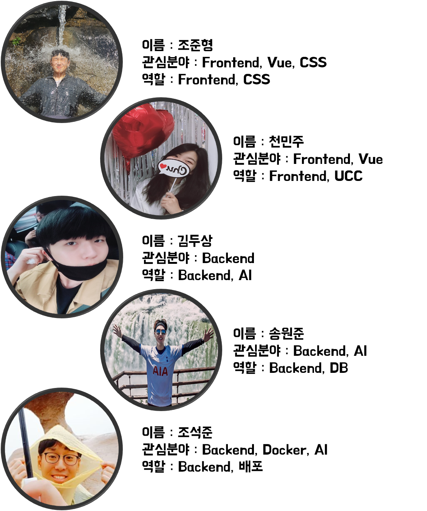

 

# Sma-IT

### '얼굴 인식을 통한 효율적 마케팅 실현 서비스'

프로젝트 명은 'Sma-IT'로 'Smart marketing IT' 라는 뜻을 함축적으로 담았습니다.

# 기획배경

# 프로젝트 상세 소개

### Mask 착용 체크

- 

### 방문 고객 정보 캡셔닝

- 

### 얼굴 인식 결제

- 

### 감정 분석을 통한 만족도 기록

- 

# 팀 구성원 소개 및 역할

