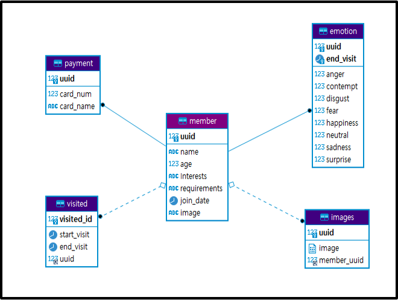
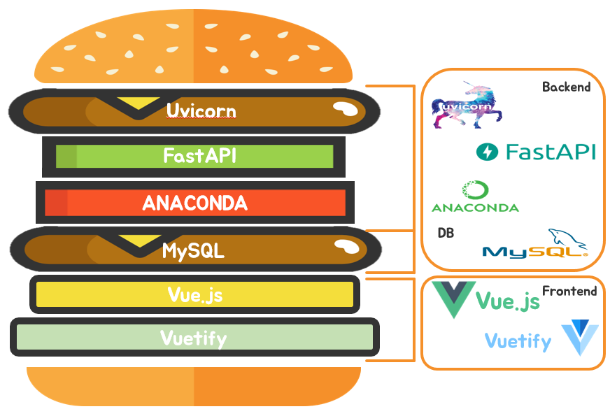

<div style="width:100%; height:100px "></div>

   

# Sma-IT

### '얼굴 인식을 통한 효율적 마케팅 실현 서비스'

프로젝트 명은 'Sma-IT'로 'Smart Marketing With IT' 라는 뜻을 갖고 있으며,

한글 뜻으론 "강타하다"라는 뜻으로, 고객님의 마음을 강타하는 마켓팅을 하자라는

함축적 의미를 담고있습니다.

# 기획 배경

매장 방문시 발생할 수 있는 이슈에서 얼굴 인식만을 통해

고객의 관심사나 요구사항 등을 직원이 미리 알고 취향저격 서비스를 제공할 수 있으며,

얼굴 인식을 통한 간편 결제 및 감정 분석을 통한 만족도 검사가 가능합니다.

즉 얼굴만 들고 다닌다면, 모든 이슈에 대응할 수 있는 편리한 매장을

구현하고자 기획하게 되었습니다.

# Smait 기능 소개

### Mask 착용 체크

- 코로나 19로 인한 고객님들의 방역에 대한 불안감을 덜어드리기 위해서

  ```
  매장 방문시 입장때 얼굴 인식을 통한 마스크 착용 여부를 확인하여 
  ```

→ 마스크를 착용했을 경우에는 입장 가능

→ 마스크를 미착용했을 경우에는 입장이 불가능하다는 안내를 하게 됩니다.

마스크 인식 방법

 → 사진의 얼굴 영역만 먼저 추출

 → 이후 미리 학습이 되있는 cnn모델을 사용하여 마스크여부를 수치로 리턴

 → 수치를 비교하여 마스크 여부를 판단

https://github.com/SeongMin2/COVID-19-Face-mask-detector

### 방문 고객 정보 캡셔닝

- 마스크 착용에 대한 판단이 마친 후, 마스크를 착용한 고객님께서

  매장에 등록된 고객님이시라면, 고객님의 정보를 매장 직원용 Page를 통해서

볼 수 있어, 응대에 앞서 고객님의 관심사 및 요구사항을 알 수 있습니다.

### 얼굴 인식 결제

- 매장에 방문 했을 때, 지갑 또는 핸드폰을 두고 와서

  결제를 못하고 돌아가시는 경우를 방지하고자, 얼굴 인식을 통해서

  등록해놓은 결제 시스템으로 간편 결제를 할 수 있습니다.

### 감정 분석을 통한 만족도 기록

- 매장을 떠나실 때, 만족도 평가를 남기고 싶지만,

  많은 항목의 설문조사는 번거로워 하지 않는 경우가 많기 때문에,

  이런 상황을 방지하기 위해, 얼굴 인식을 통한 감정 분석을 통해

  만족도를 기록할 수 있습니다.

# Installation

### Frontend

```bash
cd frontend
npm install
npm run serve
```

Microsoft Azure FaceAPI Key & EndPoint 생성 필요

### Backend

```bash
cd backend
cd app

pip install fastapi uvicorn[standard]
pip install pip cmake numpy opencv-python-headless pillow

apt-get update
apt-get install ffmpeg libsm6 libxext6  -y

pip install dlib
pip install face_recognition

pip install pymysql sqlalchemy python-multipart
pip install async-exit-stack async-generator
pip install tensorflow

uvicorn main:app --reload
```

## docker-compose.yml

- docker-compose 파일을 통해 젠킨스와 mysql 컨테이너를 실행

- docker-compose 설치 및 실행

  ```bash
  sudo curl -L https://github.com/docker/compose/releases/download/1.25.0-rc2/docker-compose-`uname -s`-`uname -m` -o /usr/local/bin/docker-compose
  sudo chmod +x /usr/local/bin/docker-compose
  # docker-compose 실행
  sudo docker-compose up -d
  ```

- http://<your-domain>:<jenkins-port> 접속 후 admin password 입력

  ```bash
  # admin password 확인(ubuntu 기준)
  cat /var/jenkins_home/secrets/initialAdminPassword
  ```

### Docker & Jenkins

- Docker에 Jenkins image를 만들고 git commit 시 자동으로 업데이트 반영 되도록 배포
- Frontend와 Backend에 각각 Dockerfile을 생성해 배포 설정을 저장

### Nginx & SSL

- HA와 Load Balancing을 위하여 Nginx 적용
- SSL 키를 적용하여 https 준수

### DB

- Docker에 Mysql 컨테이너를 생성하여 docker network를 연결하여 사용

- MySQL 컨테이너 bash 쉘 접속 및 서버 접속

  ```bash
  docker exec -it <mysql-container-name> bash
  root@f3af78fa6428:/#mysql -u root -p
  <enter root password>
  mysql>
  ```

- 데이터베이스와 사용자를 생성하고 (컨테이너 내에서) MySQL 권한 부여

  ``` bash
  mysql> CREATE USER '<user name>'@'%' IDENTIFIED BY '<password>';
  Query OK, 0 rows affected (0.00 sec)
  
  mysql> GRANT ALL PRIVILEGES ON *.* TO '<user name>'@'%';
  Query OK, 0 rows affected (0.00 sec)
  
  mysql> flush privileges;
  Query OK, 0 rows affected (0.00 sec)
  
  mysql> quit
  ```

# Tech Stacks


# 프로젝트 상세 소개

### 고객 입장 얼굴 인식 페이지

* 얼굴 인식을 통한 마스크 착용 여부를 판단


---

* 마스크 착용 확인 후 얼굴 인식을 통한 등록된 고객 여부 판단

- 중복입장 시 이미 입장했다고 알림


---

### 관리자 페이지

* 얼굴 인식을 통해 현재 방문중인 고객 확인
* 현재 방문중인 고객의 입장시간 확인 가능
* 현재 방문중인 고객의 최근 만족도 결과 확인 가능


---

### 만족도 검사 페이지

* 감정 분석을 통해 만족도를 그래프로 확인


---

* 감정 분석 완료 후 현재 방문 목록에서 제거


---

### 결제 페이지

* 결제할 금액 확인

* 얼굴 인식을 통해 고객의 정보를 가져와 결제 수단 확인 후 결제


---

### 고객 등록 페이지

* 고객 등록이 가능한 페이지
* 프로필 사진, 이름, 나이, 요구사항, 관심분야, 카드정보를 입력


---

### 고객 정보 수정 페이지

* 현재 등록된 멤버 확인 가능
* 스크롤을 통해 추가적인 멤버 확인

* 최근 입장시간과 퇴장시간 확인 가능


---

* 고객의 정보 수정, 삭제 가능


# ER-Diagram



# 기술스택



# 진행프로세스


# 팀 구성원 소개 및 역할


